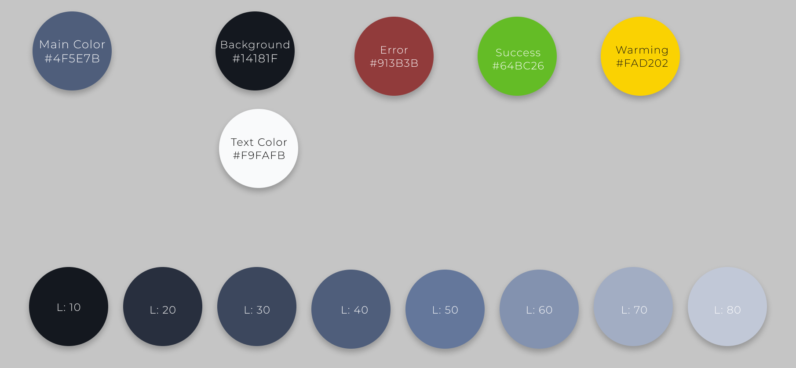

# React Realtime Chat (Front-end)

This is a frontend part of the a personal project. The ideia here is to implement a realtime chat with RabbitMQ,
create an authentication without any libraries and explore more about ui/ux design.

Check backend [here](https://github.com/Andre-Sacilotti/api-realtime-chat)

## Color Palette

I used as primary color #4F5E7B, then, changed lightness to 10% and 98% to get background and text color.



## How to use

Clone the Repository, then:

```bash
npm install
npm start
```

## Contribute

Feel free to contrbute, You can fixe bugs, add new features. Just open a new issue/pull request

